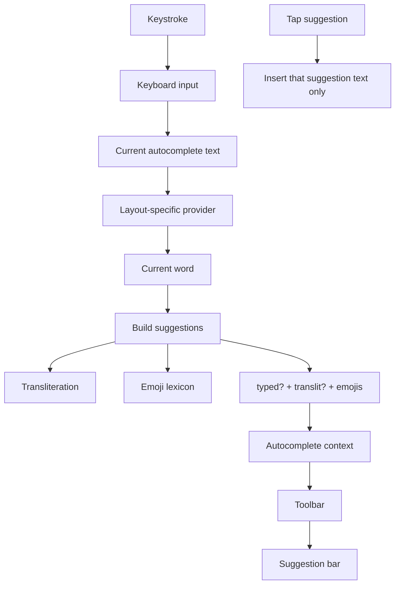

# Autosuggest (word transliteration + emoji)

| Field | Value |
| --- | --- |
| Document ID | `KEYBOARD-FS-AUTOSUGGEST` |
| Version | `1.3.2` |
| Status | Active |
| Product | Drukarnik keyboard extension |
| Component | Toolbar autocomplete |
| Last changed | 2026-09-10 |
| Parent | [keyboard.md](../keyboard.md) |

## Summary

Contract for the keyboard extension autocomplete bar: transliteration of the current word plus emoji suggestions. Audience is implementers, reviewers, and QA.

## Goals

While the user types the current word, the toolbar must offer a layout-aware transliteration and related emoji, each as a separate tappable item, without auto-replacing the word on Space.

## Non-goals

- Dictionary-style next-word prediction or multi-word completions.
- Autocorrect / auto-replace of the current word on Space or other delimiters.
- The full-text conversion overlay and the emoji picker keyboard.
- Gating suggestions on the unused `autocompleteTransliteration` setting.
- Looking up emoji by Latin keys in the lexicon.

## User-visible behavior

The bar is **display + tap only**. Each item is a separate suggestion. Tapping an item **must** insert only that item’s text (replacement of the current word). Space **must not** auto-replace the word.

| Layout | User types | Left column | Center (transliteration) | Emoji lookup key |
| --- | --- | --- | --- | --- |
| Latin | `dobr` | `dobr` | `добр` | `добр` (no emoji if key missing) |
| Latin | `dobra` | `dobra` | `добра` | `добра` → e.g. `😇 🙂 👍 🫡` |
| Cyrillic | `Агонь` | `Агонь` | `Ahoń` (case preserved) | `агонь` → e.g. `🔥` |
| Cyrillic | `добра` | `добра` | `dobra` | `добра` → emoji list |

When the typed word already matches the transliteration and the lexicon has no emoji for the Cyrillic key, the system **must** show no suggestions (options row).

When the typed word already matches the transliteration and the lexicon has emoji, the system **must** show emoji only (left and center columns empty).

After the user switches Latin ↔ Cyrillic, suggestions **must** refresh for the current word.

The toolbar **must** redraw when the suggestion list changes. Otherwise it can stay on the options row while suggestions are already available.

### Case handling

- Transliteration display **must not** lowercase the typed word for output.
- Conversion **must** run on a lowercased copy; the result **must** be re-cased from the original:
  - all-caps input → all-caps output;
  - leading capital → leading capital on output;
  - otherwise lowercase.

### Emoji lookup rules

- Lookup **must** always use a Cyrillic key: convert the lowercased typed word to Cyrillic.
- Direct Latin keys in the lexicon (e.g. `confused`) **must not** be used.
- English keys are inactive unless the Cyrillic transliteration matches a key.

### Current word

The current word **must** be the substring after the last word delimiter. Case is preserved. Empty input yields no word.

### Toolbar layout

Three-column bar:

```
[ typed word ] | [ transliteration ] | [ emoji emoji ... ]
```

- When transliteration differs from the typed word, the **left** column shows the word as typed; the **center** column shows the transliterated suggestion. Both are tappable.
- Vertical separators: 1pt, separator color.
- Word columns: 17pt, label color, horizontal padding 12. The **left** column (typed word) **must** show the title in ASCII double quotes (`"word"`). The **center** transliteration column **must not** use quotes.
- Emoji: 28pt font, fixed 44×44 tap target, no label-color override. Horizontal inset on the emoji row equals half the cell’s side margin (`(44 − 28) / 2`), so distance from the left delimiter and right edge to the first/last glyph matches the visual gap between adjacent emoji.
- Center column is centered in the middle third; emojis sit in the right third (centered in that third when they fit).
- Scroll when emoji row width (`count × 44 + 2 × inset`) exceeds `totalWidth / 3`.
- When scrolling is required, the **entire row** **must** scroll horizontally (typed word, delimiters, transliteration, emojis) — not the emoji strip alone.
- The suggestion bar uses a top-corner clip mask (inset 1pt). Corner radius is taken from the keyboard chrome view hierarchy when available, otherwise KeyboardKit `Callouts.CalloutStyle` default (`10`). SwiftUI `.mask` clips static layout; when the row scrolls, a matching `CAShapeLayer` mask is applied to the underlying `UIScrollView`.

### Toolbar vs settings overlay

| State | Toolbar content |
| --- | --- |
| Suggestions available, settings closed | Suggestion bar |
| No suggestions | Options row (gear + «Дадатковыя опцыі клавіятуры») |
| Settings open | Options row (gear stays visible so the user can close settings) |

When settings is open, a conversion overlay appears above the keyboard. A clear toolbar-height spacer **must not** steal taps from the gear button in the options row.

### Suggestion construction

For the current word, layout direction, converter, and emoji lexicon:

1. Convert the lowercased word in the layout direction; re-case for display.
2. Convert the lowercased word to Cyrillic; look up emoji.
3. If display equals the typed word **and** there are no emojis → no suggestions.
4. If display differs from the typed word → two word suggestions in order: as typed, then transliteration (`isAutocorrect` false for each).
5. Each emoji is a separate suggestion (`isAutocorrect` false).

The toolbar maps word suggestions to columns: two words → left = first (typed), center = second (transliteration); one word → center only (empty left).

An item is treated as emoji when its text has no letters and contains emoji (including ZWJ / variation selectors such as `❤️‍🔥`).

## Acceptance criteria

- [ ] When the user types a partial word whose conversion differs from input, the bar shows the typed word on the left and the transliteration in the center.
- [ ] Tapping the left word suggestion inserts the typed form; tapping the center inserts the transliteration only.
- [ ] When input already matches conversion and the lexicon has no emoji for the Cyrillic key, the bar shows the options row.
- [ ] When input already matches conversion and the lexicon has emoji, the bar shows emoji only (empty left and center columns).
- [ ] Tapping a word suggestion inserts only that suggestion’s text, not emoji from the same bar.
- [ ] Tapping an emoji suggestion inserts only that emoji.
- [ ] Space does not auto-replace the current word with a suggestion.
- [ ] Latin layout looks up emoji by the Cyrillic conversion of the typed word, not by Latin lexicon keys.
- [ ] All-caps input yields an all-caps word suggestion; a leading capital yields a leading capital.
- [ ] After switching Latin ↔ Cyrillic, the bar refreshes suggestions for the current word.
- [ ] When suggestions become non-empty, the toolbar switches from the options row to the suggestion bar without an extra keystroke.
- [ ] When emoji overflow the right third, the entire suggestion row scrolls horizontally.
- [ ] With settings open, the toolbar shows the options row and the gear remains tappable.

## Edge cases and limitations

- Partial words (`dobr`) may transliterate to a form with no lexicon key → typed + transliteration only, no emoji.
- Long emoji lists trigger horizontal scroll of the full suggestion row.
- `autocompleteTransliteration` exists but has no UI toggle and does not disable autosuggest.

## Configuration

| Key | Default | Effect |
| --- | --- | --- |
| `autocompleteTransliteration` | `true` | **Must not** gate autosuggest today; reserved for future UI |
| `belarusianLatinType` | user setting | **Must** affect conversion |
| `belarusianCyrillicType` | user setting | **Must** affect conversion |

Lexicon file format: `{ "добра": "😇 🙂 👍 🫡", ... }`. Keys **must** be lowercase Cyrillic (or match the lowercased Cyrillic transliteration of the typed word). The bundle copy is shared with unit tests.

## Data flow



## Verification

| Test target | Coverage |
| --- | --- |
| `KeyboardTests` | Word build, case, emoji key, toolbar columns/partition/scroll, lexicon load |

Run: scheme `Drukarnik`, target `KeyboardTests`. Criteria without an automated test are checked manually on Simulator (tap insert, Space does not autocorrect, settings overlay vs gear, layout switch refresh, toolbar redraw).

## References

### Documents

| ID | Title | Relation |
| --- | --- | --- |
| `KEYBOARD-FS-ROOT` | [keyboard.md](../keyboard.md) | Parent functional specification |

### External dependencies

| Dependency | Usage |
| --- | --- |
| [KeyboardKit](https://github.com/KeyboardKit/KeyboardKit) | Autocomplete provider, suggestion model, insert-on-tap, system keyboard toolbar |
| [BelarusianLacinka](https://github.com/pikoshyk/belarusianlacinka) | Latin ↔ Cyrillic conversion |

### Source code

| Path | Role |
| --- | --- |
| `Keyboard/Keyboards/DKAutocompleteWordSuggestions.swift` | Word extraction, build, case, emoji detection, bar layout helpers |
| `Keyboard/Keyboards/Lacin/DKLatinAutocompleteProvider.swift` | Latin layout → Cyrillic transliteration |
| `Keyboard/Keyboards/Cyrillic/DKCyrillicAutocompleteProvider.swift` | Cyrillic layout → Latin transliteration |
| `Keyboard/Keyboards/DKKeyboardViewController.swift` | Wires provider per layout; refreshes suggestions after layout change |
| `Keyboard/Keyboards/Emoji/DKEmojiAutocompleteLexicon.swift` | Loads and caches `emoji.json` |
| `Drukarnik/Resources/emoji.json` | Lexicon: Cyrillic key → space-separated emoji |
| `Keyboard/Keyboards/DKLocalizationKeyboard.swift` | Conversion wrapper and user converter types |
| `Keyboard/Keyboards/DKAutocompleteSuggestionsView.swift` | Three-column toolbar UI |
| `Keyboard/Keyboards/DKAutocompleteSuggestionItemView.swift` | Delimiter, button, word label styles |
| `Keyboard/Keyboards/DKKeyboardToolbarView.swift` | Suggestions vs options toolbar |
| `Keyboard/Keyboards/DKKeyboardToolbarContent.swift` | Toolbar content switch |
| `Keyboard/Keyboards/DKKeyboardViewModel.swift` | Forwards autocomplete suggestions into SwiftUI |
| `Keyboard/Keyboards/DKKeyboardView.swift` | Wires system keyboard toolbar to the bar |

Latin vs Cyrillic provider mapping: `.latin` → Latin provider / to-Cyrillic; `.cyrillic` → Cyrillic provider / to-Latin.

### Verification artifacts

| Path | Role |
| --- | --- |
| `KeyboardTests/DKAutocompleteWordSuggestionsTests.swift` | Build logic, case, emoji key |
| `KeyboardTests/DKAutocompleteToolbarLogicTests.swift` | Toolbar partition, layout, scroll |
| `KeyboardTests/DKEmojiAutocompleteLexiconTests.swift` | Lexicon load and cache |
| `KeyboardTests/emoji.json` | Test lexicon bundle copy |
